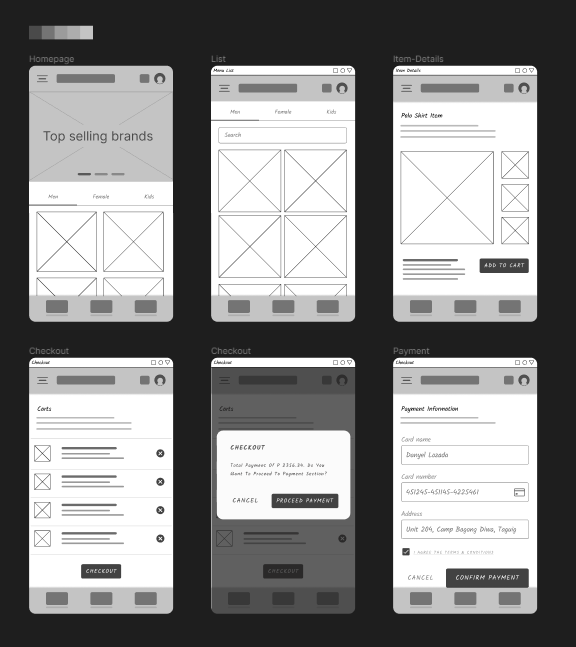

# BSCPE STORE WEB APP REDESIGN

This is a redesign from our previous school project during college. Selected this project as case study in redesigning its overall layout and system architecture from front-end to back-end. [Previous Project ➡️](https://bscpe-store.web.app/)

### Initial Wireframing for Content Structure

### Tools/Packages used on re-designing:

> 🍃 React Boilerplate (Front-end) > ***Typescript***

> 🍃 Tailwaindcss (CSS styling)

> 🍃 ~~React-Router-Dom (Browser Routing)~~

> 🍃 ~~Date-fns (Date formater)~~

> 🍃 ~~Framer-Motion (Animation)~~

> 🍃 ~~Firebase (Back-end)~~

> 🍃 ~~suspend-react (React Suspense)~~

> 🍃 heroicons (Tailwindcss SVG Icons)

> 🍃 ~~react-easy-crop (Image cropper)~~

> 🍃 more ...

### Duration

 

 
June 20 2022 (Project started)

     
    • <b>Date Started<b>
     
    • First git commit

 
July 4, 2022 (Previous patch)

     
    • Deployed beta version of the web app with firebase hosting [Link](https://bscpe-store-v2.web.app)

 
July 17, 2022 (Current patch)

     
    • Refactor some codes to an reusable components.
      
    • Merged with Typescript

  

 
In progress

  
 In progress

 
 
 

### Author

[Danyel Lozada](https://github.com/adazol123)